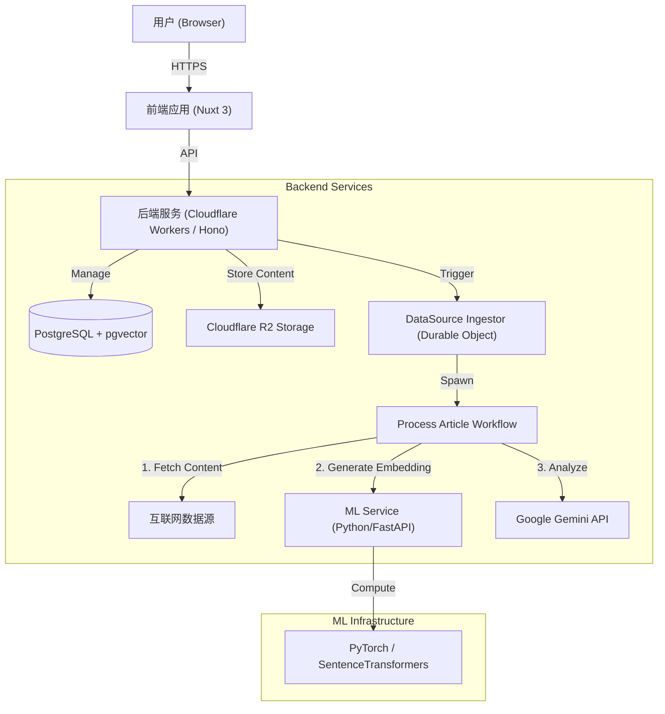

# Meridian AI News Aggregator - 总体架构设计

## 1. 项目概述

**项目名称**: Meridian
**项目目标**: 构建一个智能化的 AI 新闻聚合平台，自动从 RSS 等数据源采集信息，利用大模型进行内容分析与摘要，并通过向量检索提供语义搜索能力。

**核心功能**:
- **多源采集**: 支持 RSS/Atom 等多种数据源配置与自动抓取。
- **智能分析**: 利用 LLM (Google Gemini) 对文章进行摘要、分类和关键信息提取。
- **语义搜索**: 基于 Embedding 向量化技术，提供超越关键词的语义检索体验。
- **持久化存储**: 结合 PostgreSQL (元数据/向量) 与 R2 (大文本/原始内容) 的混合存储架构。

## 2. 系统逻辑架构

系统采用现代化的 Monorepo 架构，前后端分离，计算与存储分离。



## 3. 核心模块设计

### 3.1 前端层 (Apps/Frontend)
- **技术栈**: Nuxt 3, Vue 3, TailwindCSS, Shadcn UI。
- **职责**:
  - **用户界面**: 展示新闻流、文章详情、搜索界面。
  - **管理后台**: 配置数据源 (Data Sources)、查看采集状态、手动触发采集。
  - **交互逻辑**: 调用后端 API，处理用户认证（如有）。

### 3.2 后端层 (Apps/Backend)
- **技术栈**: Cloudflare Workers, Hono, Drizzle ORM。
- **核心组件**:
  - **API Router**: 处理 HTTP 请求，如 `/api/sources`, `/api/articles`。
  - **Durable Objects (DO)**:
    - `DataSourceIngestorDO`: 负责单个数据源的调度与状态管理。利用 DO 的单线程特性确保不会对同一源并发抓取，维护 `last_checked` 状态。
  - **Workflows**:
    - `ProcessIngestedItemWorkflow`: 异步处理流水线。
      1. **Fetch**: 获取原文（Fetch API 或 Browser Rendering）。
      2. **Clean**: 使用 `@mozilla/readability` 提取正文。
      3. **Embed**: 调用 ML Service 生成向量。
      4. **Analyze**: 调用 LLM 生成摘要与元数据。
      5. **Save**: 存入 PostgreSQL 和 R2。

### 3.3 机器学习服务 (Services/ML-Service)
- **技术栈**: Python 3.11, FastAPI, Sentence-Transformers, Uvicorn。
- **职责**:
  - 提供内部 API (如 `/embeddings`)。
  - 运行轻量级 ML 模型 (如 `all-MiniLM-L6-v2`) 生成 384 维文本向量。
  - 部署在支持 GPU/CPU 的容器环境中 (本地 Docker 或 Fly.io)。

### 3.4 数据存储层 (Packages/Database)
- **PostgreSQL**:
  - **核心表**: `$publishers`, `$data_sources`, `$ingested_items`。
  - **向量支持**: 使用 `pgvector` 存储文章 Embedding，支持 HNSW 索引加速查询。
  - **状态管理**: 记录文章的处理状态 (`NEW`, `PROCESSED`, `FAILED_...`)。
- **Cloudflare R2**:
  - 存储原始抓取数据 (Raw HTML/JSON) 和 清洗后的正文 (Content Body)，减轻数据库负载。

### 3.5 日志与监控 (Packages/Logger)
- **统一日志**: 自研 `@meridian/logger` 包，提供结构化 JSON 日志。
- **覆盖范围**: Frontend (Browser/Server), Backend (Worker/DO), ML Service (Python)。
- **目的**: 分布式系统下的链路追踪与故障排查。

## 4. 关键业务流程

### 4.1 数据采集与处理流
1.  **触发**: 定时器 (Cron) 或 用户手动触发 (Admin UI) 调用 API。
2.  **调度**: API 唤醒对应的 `DataSourceIngestorDO`。
3.  **抓取**: DO 抓取 RSS Feed，解析 Item，对比数据库去重。
4.  **入库**: 新 Item 存入 `$ingested_items`，状态为 `NEW`。
5.  **处理**: DO 触发 `ProcessIngestedItemWorkflow`。
6.  **分析**: Workflow 依次执行：
    - 下载原文 -> 上传 R2 (Raw)。
    - 清洗正文 -> 上传 R2 (Clean)。
    - 调用 ML Service -> 获得 Embedding 向量。
    - 调用 LLM -> 获得摘要 (Analysis Payload)。
    - 更新 DB -> 写入向量、摘要，状态变更为 `PROCESSED`。

### 4.2 搜索流
1.  用户输入查询词。
2.  前端调用后端搜索 API。
3.  后端调用 ML Service 将查询词转换为向量。
4.  后端在 PostgreSQL 中利用 `pgvector` 进行余弦相似度搜索 (Cosine Distance)。
5.  返回相关度最高的文章列表。

## 5. 项目目录结构

```
meridian/
├── apps/
│   ├── backend/       # Cloudflare Workers 后端
│   └── frontend/      # Nuxt 3 前端
├── packages/
│   ├── database/      # Drizzle Schema 与 DB 连接逻辑
│   └── logger/        # 统一日志库
├── services/
│   └── meridian-ml-service/ # Python ML 微服务
├── docs/              # 项目文档
└── start_all.js       # 本地开发编排脚本
```

## 6. 扩展性设计
- **多模态支持**: 数据库设计已预留 `jsonb` 字段，未来可扩展图片或视频分析结果。
- **模型替换**: ML Service 封装了模型细节，可随时替换为 OpenAI Embedding 或其他开源模型。
- **水平扩展**: Cloudflare Workers 和 Durable Objects 天然支持高并发与全球分布。
