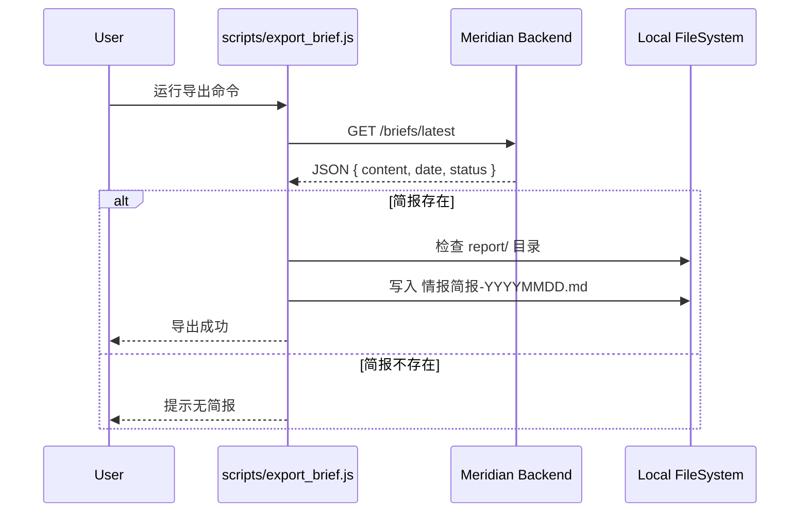

# DD-SYS-报告导出

## 1. 文档信息

| 属性 | 内容 |
| :--- | :--- |
| **文档编号** | DD-SYS-Report-Export-001 |
| **关联 PRD** | PRD-SYS-报告导出 |
| **状态** | 进行中 |
| **版本** | v1.0 |

## 2. 变更记录

| 日期 | 版本 | 修改人 | 描述 |
| :--- | :--- | :--- | :--- |
| 2026-02-14 | v1.0 | Agent | 初始设计，采用本地 Node.js 脚本方案 |

## 3. 架构设计

由于 Backend 运行在 Cloudflare Workers 环境，无法直接操作宿主机文件系统。因此，采用 **C/S 架构**：
*   **Server (Backend)**: 提供 HTTP 接口，返回简报内容。
*   **Client (Local Script)**: 运行在宿主机（Node.js），调用接口并写入文件。

### 3.1 流程图



## 4. 详细设计

### 4.1 Backend 接口设计

#### 新增接口：获取最新简报
*   **Method**: `GET`
*   **Path**: `/api/briefs/latest` (或 `/briefs/latest`)
*   **Response**:
    ```json
    {
      "success": true,
      "data": {
        "content": "# 今日简报\n...",
        "generated_at": "2026-02-14T10:00:00Z",
        "date": "2026-02-14"
      }
    }
    ```

### 4.2 本地脚本设计

#### 脚本位置
`scripts/export_brief.js`

#### 核心逻辑
1.  **配置**: 设置 Backend URL（默认为 `http://localhost:8787`）。
2.  **Fetch**: 使用 `fetch` API 请求简报数据。
3.  **IO**: 使用 `fs/promises` 模块写入文件。
4.  **CLI**: 支持命令行参数（如指定日期、输出目录）。

### 4.3 集成方案
为了方便用户，可以将该脚本集成到 `package.json` 的 `scripts` 中：
```json
"scripts": {
  "export:brief": "node scripts/export_brief.js"
}
```

同时，可以在 `start_all.js` 中添加可选逻辑，在服务启动一段时间后自动尝试导出一次（非阻塞）。

## 5. 实现步骤

1.  **Backend**: 在 `apps/backend/src/routers/briefs.router.ts` 中实现 `GET /latest`。
2.  **Script**: 编写 `scripts/export_brief.js`。
3.  **Config**: 更新 `package.json`。
4.  **Verify**: 手动运行测试。
