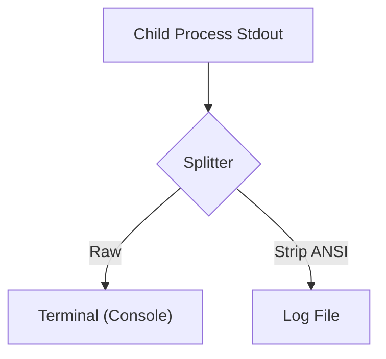

# DD-SYS-日志功能需求

## 1. 概述

本设计文档旨在解决日志文件中包含 ANSI 颜色代码导致可读性差的问题。通过在 `start_all.js` 中引入正则表达式过滤机制，在写入文件前剥离这些代码。

## 2. 变更记录

- 2026-02-14:
  - [20260214002] 完成设计与实现。
  - [20260214003] 补充日志轮转与监控设计。
  - [20260214004] 补充日志中文化设计。

---

## PRD-需求1：日志文件 ANSI 颜色代码清理 (已完成)

#### 需求编号：20260214002

### 概述

拦截子进程的 `stdout` 和 `stderr` 流，分叉处理：原样输出到终端，过滤后写入文件。

### 目标与约束

- **目标**: 纯净的日志文件。
- **约束**: 性能损耗最小化（正则匹配）。

### 功能设计

引入 `stripAnsi` 函数，使用正则表达式匹配并移除 ANSI 转义序列。

### 详细设计

#### 正则表达式

使用标准的 ANSI 匹配正则：
```javascript
const ansiRegex = /[\u001b\u009b][[()#;?]*(?:[0-9]{1,4}(?:;[0-9]{0,4})*)?[0-9A-ORZcf-nqry=><]/g;
```

#### 数据流



### 接口与数据结构

无新增接口。仅修改 `start_all.js` 内部逻辑。

### 变更清单

| 文件路径 | 变更类型 | 说明 |
| :--- | :--- | :--- |
| `start_all.js` | 修改 | 添加 `stripAnsi` 函数；修改 `p.stdout.on` 和 `p.stderr.on` 回调。 |

### 测试与验证要点

1.  启动服务。
2.  检查终端是否有颜色（确认未受影响）。
3.  检查 `logs/*.log` 文件是否无乱码。

### 设计审核报告

**审核结果**: 批准

---

## PRD-需求2：日志文件轮转与监控增强 (已完成)

#### 需求编号：20260214003

### 概述

1.  **轮转**: 修改启动脚本，生成时间戳文件。
2.  **监控**: 利用 Cloudflare Worker Cron Trigger 实现轻量级源状态巡检。

### 功能设计

#### 1. 日志轮转 (start_all.js)

- **逻辑**: 在 `run` 函数中，生成文件名时追加 `YYYY-MM-DD-HH-mm-ss` 后缀。
- **清理**: (可选) 暂时不自动清理旧日志，留给运维手动管理。

#### 2. 源状态监控 (Backend Worker)

- **触发器**: `scheduled` handler (Cron: `* * * * *`)。
- **逻辑**:
  1.  查询数据库 `data_sources` 表，获取 `id`, `url`, `last_checked_at`, `frequency`。
  2.  遍历计算 `next_check = last_checked_at + frequency`。
  3.  `diff = next_check - now`。
  4.  Logger 输出 Info 级别日志。

### 详细设计

#### Log Rotation 实现
```javascript
const timestamp = new Date().toISOString().replace(/[:.]/g, '-');
const logFileName = `${name.replace(/\s+/g, '_')}_${timestamp}.log`;
```

#### Cron Job 实现
在 `apps/backend/src/index.ts`:

```typescript
async scheduled(event: ScheduledEvent, env: Env, ctx: ExecutionContext) {
  const db = getDb(env.DATABASE_URL);
  const sources = await db.query.data_sources.findMany({
    where: eq(schema.data_sources.status, 'ACTIVE'),
    columns: { id: true, url: true, lastCheckedAt: true, frequency: true }
  });
  
  const now = Date.now();
  for (const source of sources) {
    // ... calculation ...
    console.log(`[SourceMonitor] ...`);
  }
}
```

### 变更清单

| 文件路径 | 变更类型 | 说明 |
| :--- | :--- | :--- |
| `start_all.js` | 修改 | 增加时间戳文件名生成逻辑。 |
| `apps/backend/src/index.ts` | 修改 | 增加 `scheduled` 导出函数。 |
| `apps/backend/wrangler.jsonc` | 修改 | 增加 `triggers.crons` 配置。 |

### 测试与验证要点

1.  **轮转**: 重启服务，确认 `logs/` 下生成新文件。
2.  **监控**: 等待 1 分钟，确认 Backend 日志中出现 `[SourceMonitor]` 记录。

---

## PRD-需求3：日志记录中文化 (待实现)

#### 需求编号：20260214004

### 概述

修改 `start_all.js` 和后端监控代码，将英文日志替换为中文。

### 功能设计

#### 1. 启动脚本 (start_all.js)

替换硬编码的字符串。

| 原文 | 中文 |
| :--- | :--- |
| "Starting..." | "正在启动..." |
| "Services started" | "所有服务已启动" |
| "exited with code" | "退出，代码" |

#### 2. 后端监控 (Backend)

在实现监控逻辑时，直接使用中文模板字符串。

```typescript
console.log(`[SourceMonitor] 源 ${source.url} (ID: ${source.id}) 距离下次抓取还有 ${diff} 秒`);
```

### 变更清单

| 文件路径 | 变更类型 | 说明 |
| :--- | :--- | :--- |
| `start_all.js` | 修改 | 汉化日志字符串。 |
| `apps/backend/src/index.ts` | 修改 | (如果已存在监控代码) 汉化日志；(若新建) 直接写中文。 |

---

## PRD-需求4：日志归档与历史管理 (已完成)

#### 需求编号：20260214008

### 概述

在 `start_all.js` 脚本启动流程的最前端（创建任何新日志流之前），插入文件归档逻辑。

### 功能设计

#### 1. 归档流程 (start_all.js)

1.  **路径定义**:
    - `LOG_DIR = path.join(__dirname, 'logs')`
    - `HISTORY_DIR = path.join(LOG_DIR, 'history')`
2.  **检查与创建**:
    - 如果 `HISTORY_DIR` 不存在，使用 `fs.mkdirSync(HISTORY_DIR, { recursive: true })` 创建。
3.  **文件扫描**:
    - `fs.readdirSync(LOG_DIR)` 获取文件列表。
    - 过滤条件: `file.endsWith('.log')` 且 `fs.statSync(...).isFile()`。
4.  **移动操作**:
    - 遍历过滤后的文件。
    - 使用 `fs.renameSync(oldPath, newPath)` 将文件移动到 `HISTORY_DIR`。
    - 错误处理: 使用 `try-catch` 包裹，打印错误但不阻断启动。

### 详细设计

```javascript
function archiveOldLogs() {
  const logDir = path.join(__dirname, 'logs');
  const historyDir = path.join(logDir, 'history');

  if (!fs.existsSync(logDir)) return;

  try {
    if (!fs.existsSync(historyDir)) {
      fs.mkdirSync(historyDir, { recursive: true });
    }

    const files = fs.readdirSync(logDir);
    files.forEach(file => {
      if (file.endsWith('.log')) {
        const oldPath = path.join(logDir, file);
        // Ensure it is a file and not a directory (though endsWith .log usually implies file)
        if (fs.statSync(oldPath).isFile()) {
           const newPath = path.join(historyDir, file);
           fs.renameSync(oldPath, newPath);
           console.log(`[System] Archived log: ${file}`);
        }
      }
    });
  } catch (err) {
    console.error('[System] Failed to archive logs:', err);
  }
}

// Call this function before creating any write streams
archiveOldLogs();
```

### 变更清单

| 文件路径 | 变更类型 | 说明 |
| :--- | :--- | :--- |
| `start_all.js` | 修改 | 新增 `archiveOldLogs` 函数并在 main 流程最开始调用。 |

### 测试与验证要点

1.  **预置条件**: 在 `logs/` 下创建几个假的 `.log` 文件。
2.  **执行**: 运行 `node start_all.js`。
3.  **验证**:
    - `logs/` 下无旧文件。
    - `logs/history/` 下包含刚才的旧文件。
    - 新生成的日志文件位于 `logs/`。

