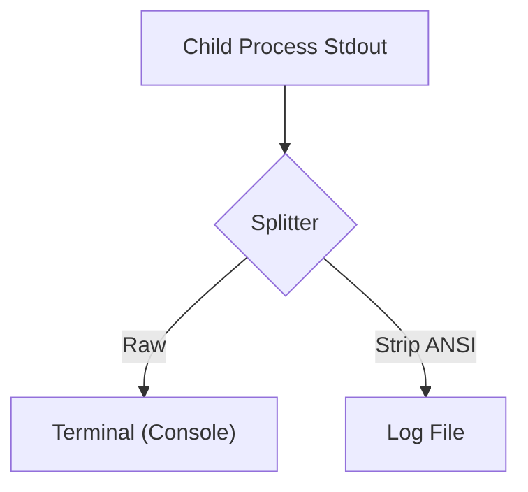

# DD-SYS-日志功能需求

## 1. 概述

本设计文档旨在解决日志文件中包含 ANSI 颜色代码导致可读性差的问题。通过在 `start_all.js` 中引入正则表达式过滤机制，在写入文件前剥离这些代码。

## 2. 变更记录

- 2026-02-14:
  - [20260214002] 完成设计与实现。

---

## PRD-需求1：日志文件 ANSI 颜色代码清理 (已完成)

#### 需求编号：20260214002

### 概述

拦截子进程的 `stdout` 和 `stderr` 流，分叉处理：原样输出到终端，过滤后写入文件。

### 目标与约束

- **目标**: 纯净的日志文件。
- **约束**: 性能损耗最小化（正则匹配）。

### 功能设计

引入 `stripAnsi` 函数，使用正则表达式匹配并移除 ANSI 转义序列。

### 详细设计

#### 正则表达式

使用标准的 ANSI 匹配正则：
```javascript
const ansiRegex = /[\u001b\u009b][[()#;?]*(?:[0-9]{1,4}(?:;[0-9]{0,4})*)?[0-9A-ORZcf-nqry=><]/g;
```

#### 数据流



### 接口与数据结构

无新增接口。仅修改 `start_all.js` 内部逻辑。

### 变更清单

| 文件路径 | 变更类型 | 说明 |
| :--- | :--- | :--- |
| `start_all.js` | 修改 | 添加 `stripAnsi` 函数；修改 `p.stdout.on` 和 `p.stderr.on` 回调。 |

### 测试与验证要点

1.  启动服务。
2.  检查终端是否有颜色（确认未受影响）。
3.  检查 `logs/*.log` 文件是否无乱码。

### 设计审核报告

**审核结果**: 批准
