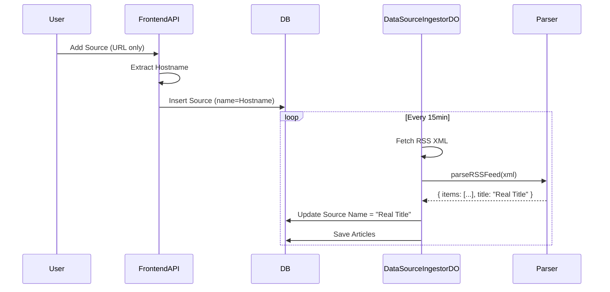
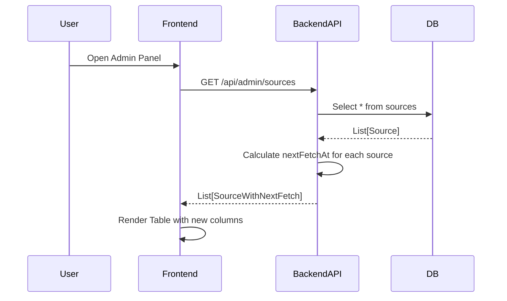
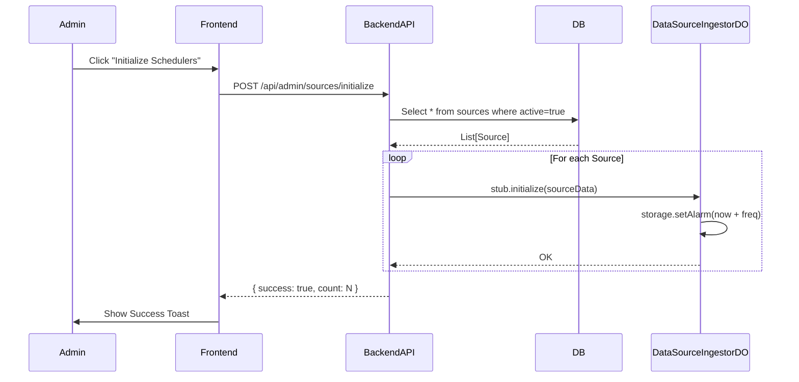
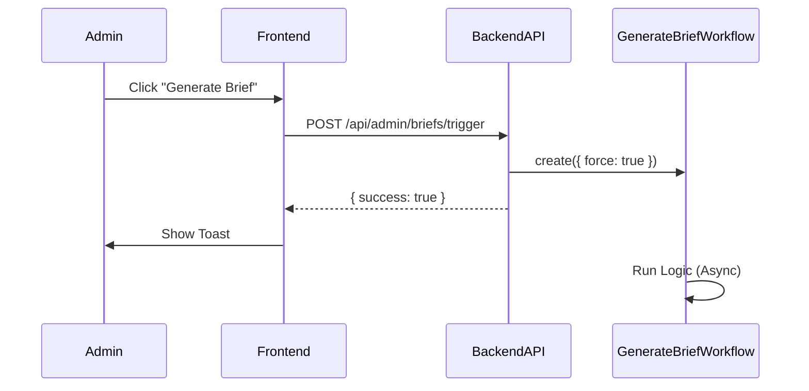

# DD-WEB-Admin页面需求

## 1. 概述

本设计文档旨在解决 Admin Panel "Source Analytics" 列表中的数据显示异常问题，包括日期格式化错误 (NaN)、统计比率错误 (N/A%) 以及源名称缺失 (Unknown)。修复方案涉及前端展示逻辑增强与后端数据源名称自动补全。此外，还包括了调度器初始化与手动触发情报汇总的设计。

## 2. 变更记录

- **2026-02-14**: [20260214012] 新增 Admin 页面汉化设计。
- **2026-02-14**: [20260214011] 新增手动触发情报汇总功能设计。
- **2026-02-14**: [20260214006] 新增调度器初始化功能设计。
- **2026-02-14**: [20260214005] 新增抓取时间列设计。
- **2026-02-14**: [20260214001] 完成数据修复设计与实现。

---

## PRD-需求12：Admin 页面汉化 (待实现)

### 概述

为了提升中文用户的操作体验，将 Admin 后台管理界面进行全面汉化。本设计采用直接替换 Vue 模板文本的方式，快速实现本地化，暂不引入复杂的 i18n 框架。

### 目标与约束

- **目标**: 将 Admin 页面所有可见的英文标签、按钮、表头替换为中文。
- **约束**:
    - 仅修改前端 UI 显示，不修改后端 API 字段名或数据库枚举值。
    - 保持现有布局结构不变。

### 功能设计

#### 1. 前端文本替换 (Frontend)

在 `apps/frontend/src/pages/admin/index.vue` 及相关组件中执行文本替换。

**主要替换区域**:
1.  **页面标题与概览**:
    - `Admin Panel` -> `管理后台`
    - `System Overview` -> `系统概览`
2.  **统计卡片**:
    - `Total Sources` -> `总数据源`
    - `Articles Fetched` -> `已抓取文章`
    - `Articles Processed` -> `已处理文章`
    - `Errors` -> `错误数`
3.  **操作按钮**:
    - `Initialize Schedulers` -> `初始化调度器`
    - `Generate Briefing` -> `生成情报简报`
    - `Add Source` -> `添加数据源`
    - `Reprocess Articles` -> `重处理文章`
4.  **数据表格 (Columns)**:
    - `SOURCE` -> `数据源`
    - `FREQUENCY` -> `频率`
    - `LAST FETCH` -> `上次抓取`
    - `NEXT FETCH` -> `下次抓取`
    - `AVG/DAY` -> `日均量`
    - `ERROR RATE` -> `错误率`
    - `ACTIONS` -> `操作`

#### 2. 代码实现示例

```typescript
// columns 定义
const columns = [
  { key: 'name', label: '数据源' },
  { key: 'scrape_frequency', label: '频率' },
  { key: 'last_fetched_at', label: '上次抓取' },
  // ...
]
```

### 验证计划

1.  **界面检查**: 逐一核对页面上的每个文本元素，确保无残留英文。
2.  **布局检查**: 确认中文字符未导致表格列宽异常或按钮换行。

---

## PRD-需求1：Admin Panel 数据显示修复 (已完成)

### 概述

修复 Admin Panel 中影响数据可读性的三个核心问题：
1.  **日期显示**: 修复 `NaN-NaN-NaN` 问题。
2.  **比率计算**: 修复分母为 0 或数据缺失导致的 `N/A%` 问题。
3.  **源名称**: 解决新增 RSS 源默认为 "Unknown" 的问题，实现从 URL 或 RSS 内容自动获取名称。

### 目标与约束

- **目标**: 提升 Admin Panel 数据准确性与可读性。
- **约束**:
    - 兼容现有数据库 Schema，尽量减少 Schema 变更。
    - 前端显示逻辑需具备鲁棒性，能够处理后端返回的 `null` 或非法值。

### 功能设计

#### 1. 前端显示逻辑增强 (Frontend)

在 `apps/frontend/src/pages/admin/index.vue` 中优化数据绑定逻辑：

- **日期格式化 (`formatDate`)**:
    - 增加对 `null` / `undefined` 的检查。
    - 增加对 `Invalid Date` (`Number.isNaN(date.getTime())`) 的检查。
    - 异常情况统一返回 "Never"。
- **比率显示**:
    - 使用 `(value ?? 0).toFixed(1)` 确保数值存在。
    - 默认值设为 0，避免 undefined 导致渲染为空。

#### 2. 源名称自动补全 (Backend & Frontend)

采取 "双重保障" 策略确保 Source Name 有值：

1.  **前端创建时回退 (Frontend API)**:
    - 在 `apps/frontend/src/server/api/admin/sources/index.post.ts` 中。
    - 若用户未输入名称，默认使用 RSS URL 的 Hostname (如 `feed.xml` -> `example.com`) 作为初始名称，而非硬编码的 "Unknown"。

2.  **后端采集时更新 (Backend DO)**:
    - 在 `apps/backend/src/durable_objects/dataSourceIngestorDO.ts` 中。
    - 在首次成功解析 RSS Feed 时，从 XML 中提取 `<title>`。
    - 若数据库中当前名称为 "Unknown" 或与 URL Hostname 相同（即由步骤 1 生成的临时名称），则自动更新为 RSS Feed 的真实标题。

3.  **解析器增强**:
    - 修改 `apps/backend/src/lib/parsers.ts` 中的 `parseRSSFeed`，使其返回 `items` 的同时返回 channel `title`。

### 详细设计

#### 类图/数据流



### 接口与数据结构

- **`parseRSSFeed` 返回值变更**:
  ```typescript
  // Before
  Promise<Result<z.infer<typeof rssFeedSchema>[], Error>>
  
  // After
  Promise<Result<{ items: z.infer<typeof rssFeedSchema>[]; title?: string }, Error>>
  ```

### 异常与边界

- **RSS 无标题**: 若 XML 中无 `<title>`，保持原有名称（Hostname）。
- **日期解析失败**: 前端显示 "Never"，不中断页面渲染。

### 变更清单

1.  `apps/frontend/src/pages/admin/index.vue`: 修改 `formatDate` 和 Template 插值逻辑。
2.  `apps/frontend/src/server/api/admin/sources/index.post.ts`: 修改默认名称生成逻辑。
3.  `apps/backend/src/lib/parsers.ts`: 修改 `parseRSSFeed` 提取 title。
4.  `apps/backend/src/durable_objects/dataSourceIngestorDO.ts`: 增加更新 Source Name 的 SQL 逻辑。

### 测试与验证要点

1.  **新建源测试**: 添加一个只有 URL 的源，确认初始名称为 Hostname。
2.  **采集测试**: 触发采集（或等待自动采集），确认名称自动更新为 RSS 标题。
3.  **UI 测试**: 查看 Admin 列表，确认无 `NaN` 或 `N/A` 出现。

### 设计疑问

- **Q**: 是否需要强制用户输入名称？
- **A**: 不需要，为了体验流畅，允许只输 URL，系统自动发现名称更佳。

### 设计审核报告

（记录审核人、时间、结论）

---

## PRD-需求2：Admin Panel 抓取时间列增强 (已完成)

### 概述

为了提供更精确的运维监控能力，Admin Panel 需展示每个 RSS 源的**最后抓取时间 (Last Fetch)** 和 **下次计划抓取时间 (Next Fetch)**。本设计涉及后端计算逻辑的增强与前端表格列的扩展。

### 目标与约束

- **目标**: 让管理员直观了解抓取任务的调度状态（是否滞后、何时执行）。
- **约束**:
    - `nextFetchAt` 不存储在数据库，而是由后端 API 实时计算返回。
    - 保持表格布局整洁，避免信息过载。

### 功能设计

#### 1. 后端 API 增强 (Backend)

- **API**: `GET /api/admin/sources`
- **逻辑**:
    - 遍历所有 Sources。
    - 计算 `nextFetchAt`:
        ```typescript
        const lastChecked = source.lastCheckedAt ? new Date(source.lastCheckedAt).getTime() : 0;
        const intervalMs = (source.scrapeFrequencyMinutes || 60) * 60 * 1000;
        const nextFetchAt = lastChecked > 0 ? new Date(lastChecked + intervalMs) : new Date(Date.now()); // 如果从未抓取，假定立即执行
        ```
    - 将 `nextFetchAt` 添加到响应对象中。

#### 2. 前端表格扩展 (Frontend)

- **文件**: `apps/frontend/src/pages/admin/index.vue`
- **变更**:
    - **Header**: 新增 "Last Fetch" 和 "Next Fetch" 表头。
    - **Data Row**:
        - **Last Fetch**: 绑定 `source.lastCheckedAt`。格式化为 `YYYY-MM-DD HH:mm:ss`。
        - **Next Fetch**: 绑定 `source.nextFetchAt`。格式化为 `YYYY-MM-DD HH:mm:ss`。
    - **Sort**: 支持按 `nextFetchAt` 排序。

### 详细设计

#### 类图/数据流



### 接口与数据结构

- **Response DTO**:
  ```typescript
  interface AdminSourceItem {
      id: string;
      name: string;
      url: string;
      lastCheckedAt: string | null;
      scrapeFrequencyMinutes: number;
      // ... other fields
      nextFetchAt: string; // ISO 8601 Date String
  }
  ```

### 异常与边界

- **从未抓取**: `lastCheckedAt` 为 null。
    - `Last Fetch` 显示 "Never"。
    - `Next Fetch` 显示当前时间（表示应立即抓取）。
- **已过期 (Overdue)**: 当前时间 > `nextFetchAt`。
    - 前端暂不作特殊红色高亮，通过 `Next Fetch` 时间早于当前时间可推断。

### 变更清单

1.  `apps/frontend/src/server/api/admin/sources/index.get.ts`: 修改 `GET /sources` 路由处理函数，注入 `nextFetchAt`。
2.  `apps/frontend/src/pages/admin/index.vue`:
    - 修改 `<Table>` 结构，增加两列。
    - 使用 `formatDate` 格式化时间。
    - 增加 `nextFetchAt` 排序逻辑。

### 测试与验证要点

1.  **时间准确性**: 验证 `Next Fetch` = `Last Fetch` + `Frequency`。
2.  **UI 适配**: 确认新增列后表格不换行错乱。
3.  **排序**: 点击 "Next Fetch" 表头，列表应按时间排序。

---

## PRD-需求3：Admin Panel 数据源调度初始化 (待实现)

### 概述

为了解决部分 RSS 源因 Durable Object (DO) 未初始化而导致调度任务（Alarm）失效的问题，需在 Admin Panel 提供一个手动触发初始化的机制。本设计包含前端操作入口与后端批量唤醒逻辑。

### 目标与约束

- **目标**: 确保所有活跃状态的 RSS 源都有正在运行的调度任务（Alarm）。
- **约束**:
    - 操作需具备幂等性（多次点击不应产生副作用，如重复 Alarm）。
    - 操作耗时可能较长，需有 Loading 反馈。
    - 仅管理员可执行。

### 功能设计

#### 1. 后端 API 设计 (Backend)

- **API**: `POST /admin/initialize-dos` (Backend Hono)
- **API (Nuxt Proxy)**: `POST /api/admin/sources/initialize` (Frontend Server)
- **逻辑**:
    1.  查询数据库中所有 `active` 的 Source。
    2.  遍历每个 Source：
        - 获取对应的 `DataSourceIngestorDO` Stub (ID derived from Source ID)。
        - 调用 `stub.initialize(source)` 方法。
    3.  **DO 内部逻辑**:
        - `initialize` 方法接收 Source 配置。
        - 检查当前 Alarm 是否存在。
        - 若不存在或需要更新，调用 `storage.setAlarm(Date.now() + frequency)`.
        - 返回 "Initialized" 或 "Updated"。
    4.  统计成功初始化的数量并返回。

#### 2. 前端交互设计 (Frontend)

- **位置**: `apps/frontend/src/pages/admin/index.vue` -> Source Analytics 表格上方工具栏。
- **组件**: `<UButton label="Initialize Schedulers" :loading="initializing" @click="initializeSchedulers" />`
- **反馈**:
    - **Success**: `useToast().add({ title: 'Success', description: 'Initialized ${count} schedulers' })`
    - **Error**: `useToast().add({ title: 'Error', color: 'red' })`

### 详细设计

#### 类图/数据流



### 接口与数据结构

- **Request**: Empty Body
- **Response**:
  ```json
  {
    "success": true,
    "count": 15,
    "message": "Initialized 15 schedulers"
  }
  ```

### 异常与边界

- **DO 不存在**: `get(id)` 会自动创建 DO 实例，符合预期。
- **超时**: 若 Source 数量过多（>50），Worker 可能超时。
    - *对策*: 暂时接受，因目前源数量较少。未来可改为 Cloudflare Workflow 异步处理。
- **并发点击**: 前端 Loading 状态防止重复提交。

### 变更清单

1.  `apps/backend/src/durable_objects/dataSourceIngestorDO.ts`: 确保 `initialize` 方法存在且逻辑正确（设置 Alarm）。
2.  `apps/backend/src/routers/admin.router.ts`: 新增 `/initialize-dos` 路由。
3.  `apps/frontend/src/server/api/admin/sources/initialize.post.ts`: 新增 Nuxt Server API 代理。
4.  `apps/frontend/src/pages/admin/index.vue`: 新增按钮与调用逻辑。

### 测试与验证要点

1.  **日志验证**: 点击按钮后，观察后端日志是否出现 `[DataSourceIngestorDO] Initializing...`。
2.  **Alarm 验证**: 使用 `wrangler` 或日志确认 Alarm 已设置。
3.  **功能验证**: 确认 "Next Fetch" 过期的源在初始化后 1-2 分钟内开始抓取（Last Fetch 更新）。

---

## PRD-需求4：Admin 手动触发情报汇总 (待实现)

### 概述

在 Admin Panel 增加手动触发全量情报汇总（Intelligence Briefing）的功能，允许管理员在非定时任务时间点（如调试、演示或紧急生成报告时）生成最新的简报。

### 目标与约束

- **目标**: 提供灵活的情报生成控制能力。
- **约束**:
    - 操作耗时较长（Workflow 异步执行），前端仅需确认触发成功，无需等待生成结果。
    - 仅管理员可执行。

### 功能设计

#### 1. 后端 API 设计 (Backend)

- **API**: `POST /admin/briefs/trigger` (Backend Hono)
- **API (Nuxt Proxy)**: `POST /api/admin/briefs/trigger` (Frontend Server)
- **逻辑**:
    1.  接收请求。
    2.  调用 `env.GENERATE_BRIEF_WORKFLOW.create({ params: { force: true } })`。
    3.  返回成功响应。

#### 2. 前端交互设计 (Frontend)

- **位置**: `apps/frontend/src/pages/admin/index.vue` -> 顶部或表格上方工具栏。
- **组件**: `<UButton label="Generate Intelligence Brief" variant="soft" :loading="generatingBrief" @click="generateBrief" />`
- **反馈**:
    - **Success**: Toast "Brief generation triggered".
    - **Error**: Toast "Failed to trigger".

### 详细设计

#### 类图/数据流



### 变更清单

1.  `apps/backend/src/routers/admin.router.ts`: 新增 `/briefs/trigger` 路由。
2.  `apps/frontend/src/server/api/admin/briefs/trigger.post.ts`: 新增 Nuxt Server API 代理。
3.  `apps/frontend/src/pages/admin/index.vue`: 新增按钮与调用逻辑。

### 测试与验证要点

1.  **触发验证**: 点击按钮后，后端日志显示 "Starting Intelligence Brief Generation"。
2.  **结果验证**: 稍后检查数据库或日志，确认新的 Report 生成。
