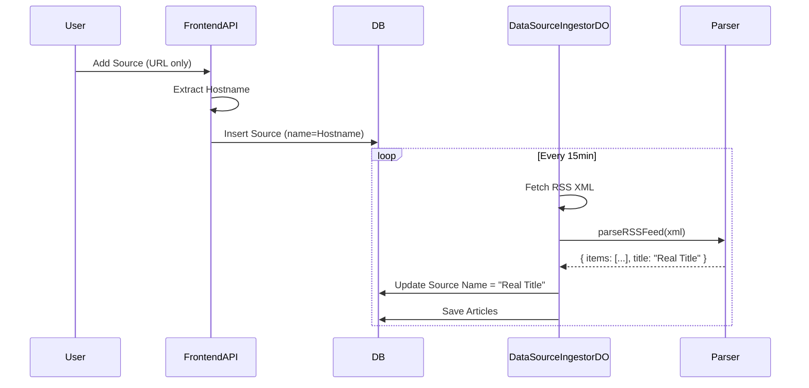

# DD-WEB-Admin页面需求

## 1. 概述

本设计文档旨在解决 Admin Panel "Source Analytics" 列表中的数据显示异常问题，包括日期格式化错误 (NaN)、统计比率错误 (N/A%) 以及源名称缺失 (Unknown)。修复方案涉及前端展示逻辑增强与后端数据源名称自动补全。

## 2. 变更记录

- **2026-02-14**: [20260214001] 完成设计与实现。

---

## PRD-需求1：Admin Panel 数据显示修复 (已完成)

### 概述

修复 Admin Panel 中影响数据可读性的三个核心问题：
1.  **日期显示**: 修复 `NaN-NaN-NaN` 问题。
2.  **比率计算**: 修复分母为 0 或数据缺失导致的 `N/A%` 问题。
3.  **源名称**: 解决新增 RSS 源默认为 "Unknown" 的问题，实现从 URL 或 RSS 内容自动获取名称。

### 目标与约束

- **目标**: 提升 Admin Panel 数据准确性与可读性。
- **约束**:
    - 兼容现有数据库 Schema，尽量减少 Schema 变更。
    - 前端显示逻辑需具备鲁棒性，能够处理后端返回的 `null` 或非法值。

### 功能设计

#### 1. 前端显示逻辑增强 (Frontend)

在 `apps/frontend/src/pages/admin/index.vue` 中优化数据绑定逻辑：

- **日期格式化 (`formatDate`)**:
    - 增加对 `null` / `undefined` 的检查。
    - 增加对 `Invalid Date` (`Number.isNaN(date.getTime())`) 的检查。
    - 异常情况统一返回 "Never"。
- **比率显示**:
    - 使用 `(value ?? 0).toFixed(1)` 确保数值存在。
    - 默认值设为 0，避免 undefined 导致渲染为空。

#### 2. 源名称自动补全 (Backend & Frontend)

采取 "双重保障" 策略确保 Source Name 有值：

1.  **前端创建时回退 (Frontend API)**:
    - 在 `apps/frontend/src/server/api/admin/sources/index.post.ts` 中。
    - 若用户未输入名称，默认使用 RSS URL 的 Hostname (如 `feed.xml` -> `example.com`) 作为初始名称，而非硬编码的 "Unknown"。

2.  **后端采集时更新 (Backend DO)**:
    - 在 `apps/backend/src/durable_objects/dataSourceIngestorDO.ts` 中。
    - 在首次成功解析 RSS Feed 时，从 XML 中提取 `<title>`。
    - 若数据库中当前名称为 "Unknown" 或与 URL Hostname 相同（即由步骤 1 生成的临时名称），则自动更新为 RSS Feed 的真实标题。

3.  **解析器增强**:
    - 修改 `apps/backend/src/lib/parsers.ts` 中的 `parseRSSFeed`，使其返回 `items` 的同时返回 channel `title`。

### 详细设计

#### 类图/数据流



### 接口与数据结构

- **`parseRSSFeed` 返回值变更**:
  ```typescript
  // Before
  Promise<Result<z.infer<typeof rssFeedSchema>[], Error>>
  
  // After
  Promise<Result<{ items: z.infer<typeof rssFeedSchema>[]; title?: string }, Error>>
  ```

### 异常与边界

- **RSS 无标题**: 若 XML 中无 `<title>`，保持原有名称（Hostname）。
- **日期解析失败**: 前端显示 "Never"，不中断页面渲染。

### 变更清单

1.  `apps/frontend/src/pages/admin/index.vue`: 修改 `formatDate` 和 Template 插值逻辑。
2.  `apps/frontend/src/server/api/admin/sources/index.post.ts`: 修改默认名称生成逻辑。
3.  `apps/backend/src/lib/parsers.ts`: 修改 `parseRSSFeed` 提取 title。
4.  `apps/backend/src/durable_objects/dataSourceIngestorDO.ts`: 增加更新 Source Name 的 SQL 逻辑。

### 测试与验证要点

1.  **新建源测试**: 添加一个只有 URL 的源，确认初始名称为 Hostname。
2.  **采集测试**: 触发采集（或等待自动采集），确认名称自动更新为 RSS 标题。
3.  **UI 测试**: 查看 Admin 列表，确认无 `NaN` 或 `N/A` 出现。

### 设计疑问

- **Q**: 是否需要强制用户输入名称？
- **A**: 不需要，为了体验流畅，允许只输 URL，系统自动发现名称更佳。

### 设计审核报告

（记录审核人、时间、结论）
