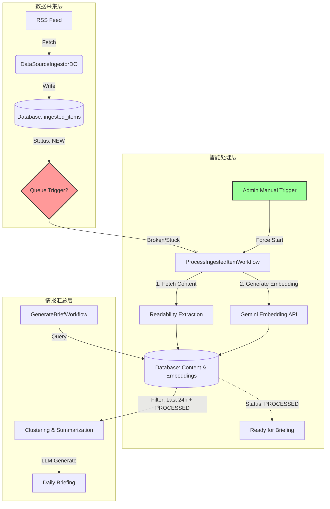

# 情报汇总失效分析报告

- **日期**: 2026-02-14
- **状态**: 已修复
- **关联需求**: 智能情报汇总 (Manual Trigger)

## 1. 问题现象

在 Admin 页面点击 "Generate Briefing" 按钮触发情报汇总时，系统提示 "No articles found in the last 24 hours"，尽管数据库中已经采集了大量 RSS 文章。

## 2. 根因分析

经过对数据库状态 (`ingested_items` 表) 和工作流逻辑 (`GenerateBriefWorkflow` vs `ProcessIngestedItemWorkflow`) 的排查，发现数据流转在 **采集 (Ingestion)** 与 **处理 (Processing)** 两个阶段之间断裂。

### 2.1 状态流转断裂
- **采集阶段 (Ingestion)**: 正常工作。`DataSourceIngestorDO` 成功抓取 RSS Feed 并将文章元数据写入数据库，此时文章状态初始化为 `NEW`。
- **处理阶段 (Processing)**: 未触发或失败。
    - 情报汇总工作流 (`GenerateBriefWorkflow`) 包含严格的过滤条件：仅选取 `status='PROCESSED'` 且 `embedding IS NOT NULL` 的文章。
    - 现状是所有最近采集的文章都滞留在 `NEW` 状态，`has_embedding` 为 `false`。
- **结论**: 由于文章未进入处理工作流（未进行清洗、内容提取和 Embedding 生成），汇总工作流判定没有可用数据。

## 3. ML-智能服务架构设计图

当前系统的数据流转逻辑如下：

## 4. 解决方案

为了解决当前数据卡顿问题并提供运维手段，实施了以下修复：

1.  **新增补救机制 (Reprocess Mechanism)**:
    - **Backend**: 新增 `POST /admin/articles/reprocess` 接口。该接口查询所有状态为 `NEW` 的文章，并手动触发 `ProcessIngestedItemWorkflow` 进行处理。
    - **Frontend**: 在 Admin 页面新增 **"Reprocess Articles"** 按钮，允许管理员一键修复卡住的数据。

2.  **代码变更**:
    - `apps/backend/src/routers/admin.router.ts`: 增加重处理路由与调试接口。
    - `apps/frontend/src/pages/admin/index.vue`: 集成重处理按钮。

## 5. 验证结果

1.  **执行修复**: 点击 "Reprocess Articles" 按钮。
2.  **日志观察**: 后端日志显示大量文章开始进入 `ProcessIngestedItemWorkflow`，状态更新为 `CONTENT_FETCHED` (见日志 `logs/backend-2026-02-14-13-21-31.log`)。
3.  **最终验证**: 待文章处理完毕（状态变更为 `PROCESSED`）后，再次点击 "Generate Briefing" 即可正常生成汇总报告。
