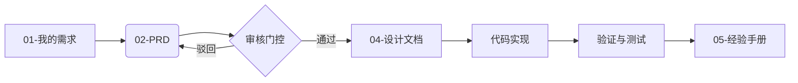

# Meridian 文档中心

Meridian 项目采用结构化的文档管理体系，所有开发、设计、运维与经验沉淀文档均统一存放于此。

## 文档目录导航

| 目录 | 职责说明 | 关键文档 |
| :--- | :--- | :--- |
| **[01-我的需求](./01-我的需求/)** | **需求源头**。存放用户原始需求，所有开发工作的起点。 | `我的需求.md` |
| **[02-产品需求文档PRD](./02-产品需求文档PRD/)** | **需求定义**。将原始需求转化为结构化的产品功能描述。 | `PRD-*.md` |
| **[03-架构设计](./03-架构设计/)** | **系统架构**。存放高层架构图、技术选型与数据流设计。 | `01-系统总体架构.md` |
| **[04-设计文档](./04-设计文档/)** | **详细设计**。对应 PRD 的技术实现方案、接口定义与数据库设计。 | `DD-*.md` |
| **[05-经验手册](./05-经验手册/)** | **知识库**。沉淀 Bug 修复记录、最佳实践与踩坑经验。 | `EXP-*.md`, `fixbug-*.md` |
| **[07-运维手册](./07-运维手册/)** | **SOP**。系统部署、配置、监控与备份恢复的操作手册。 | `01-系统运维手册.md` |
| **[08-提示词](./08-提示词/)** | **AI 交互记录**。记录关键的 Prompt 与对话总结，用于复盘。 | `提示词-*.md` |
| **[10-分析报告](./10-分析报告/)** | **深度分析**。针对特定技术难题或故障的调查报告。 | `REQ-*.md`, `Report-*.md` |

## 文档工作流

Meridian 遵循严格的文档驱动开发 (Document-Driven Development) 流程：

详细规则请参考：
- **元规则**: [AGENTS.md](../AGENTS.md)
- **审核门控**: [_policies/doc-review-gate.policy.md](./_policies/doc-review-gate.policy.md)
